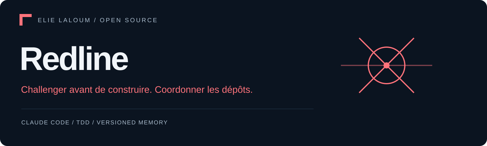
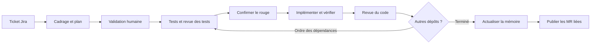

<p align="center"><a href="README.md">English</a> · <strong>Français</strong></p>

<p align="center"></p>

<p align="center"><strong>D'un ticket Jira à des merge requests GitLab coordonnées.</strong><br>Cadrer le travail. Challenger les tests. Suivre les dépendances. Conserver les acquis.</p>

<p align="center">Plugin Claude Code · TDD adversarial · Mémoire versionnée · <a href="LICENSE">MIT</a></p>

<p align="center"><a href="#commencer-par-le-code">Démarrage</a> · <a href="#le-workflow">Workflow</a> · <a href="docs/architecture.md">Architecture EN</a> · <a href="#les-vérifications">Vérifications</a> · <a href="CONTRIBUTING.md">Contribuer</a></p>

**Dépôt d’origine : [GitLab](https://gitlab.elielaloum.com/elielaloum/redline)** · [Miroir public GitHub](https://github.com/elie-laloum/redline). Le dépôt GitLab est privé ; son accès nécessite une autorisation. Les modifications du code sont intégrées dans GitLab puis synchronisées vers GitHub.

---

## Voir la démo

<a href="assets/demo.mp4"></a>

<sub>Capture de l’interface réelle avec le scénario fourni dans le dépôt. Données simulées ; ce n’est pas une exécution autonome sur un ticket réel.</sub>

[Vidéo MP4](assets/demo.mp4) · [Reproduire la démo](docs/demo.md)

## Un ticket, plusieurs dépôts

Une fonctionnalité dépasse souvent un seul dépôt. Redline coordonne le parcours du ticket Jira aux merge requests GitLab liées : clarifier le besoin, identifier les dépôts concernés, approuver un plan, implémenter et challenger chaque changement, puis conserver les enseignements pour la prochaine exécution.

**C'est un système de travail spécialisé, ouvert à d'autres développeurs.** Il repose aujourd'hui sur Claude Code, Jira Cloud, GitLab et Slack. Les chemins, commandes et dépendances sont déclarés explicitement. Les instructions des agents sont en français ; la présentation publique existe en anglais et en français.

Redline est le nouveau nom public d'**Autopilot**. Les commandes, fichiers de configuration, identifiants de plugin et le dossier d'état conservent leurs noms `autopilot`. GitHub héberge le projet ; l'intégration de publication existante crée des **merge requests GitLab**, pas des pull requests GitHub.

| Besoin | Réponse du projet |
|---|---|
| Modifier plusieurs dépôts | Des niveaux de dépendance déclarés déterminent l'ordre de traitement. |
| Donner du sens aux tests | Un agent adverse examine les tests ; un contrôle rouge précède l'implémentation. |
| Séparer les responsabilités | Tests, code, revue et mémoire disposent de rôles et d'outils distincts. Ce n'est pas un sandbox système. |
| Reprendre le travail | L'état du ticket conserve la phase, l'étape et le dépôt courant. |
| Entretenir la mémoire | Les connaissances sont versionnées et leurs contradictions avec le code peuvent être signalées. |
| Suivre la progression | Une vue live facultative lit l'état et les événements locaux et transmet les questions. |

## Le workflow



**La validation autorise la suite du workflow.** Après approbation du plan, le système peut publier des branches, tags et MR, écrire dans Slack et Jira et faire évoluer le ticket sans nouvelle validation de routine. Des escalades peuvent toujours interrompre le travail. Une publication amont peut intervenir pendant le traitement des dépendances, avant la publication finale.

Le résultat est un ensemble de merge requests à examiner. Cela ne signifie pas que les changements sont fusionnés ou déployés.

## Commencer par le code

Utiliser **Ubuntu/WSL ou un environnement Unix adapté**, Git, **Node 22.18+** et pnpm. La gestion des processus comporte des mécanismes Unix ; la compatibilité Windows native n'est pas établie.

Depuis la racine du dépôt :

```bash
pnpm install --frozen-lockfile
pnpm test
pnpm test:workflow
```

Le banc de tests de workflow crée des dépôts Git temporaires et des substituts locaux de Jira, GitLab et Slack. Il vérifie les outils et leurs contrats ; ce ne sont **pas des évaluations d'agents en conditions réelles**.

Pour traiter un vrai ticket, suivre le [guide d'installation français](docs/setup.fr.md) : déclarer les dépôts, configurer les accès et le profil rédactionnel, vérifier la configuration et charger le plugin dans Claude Code.

Le point d'entrée défini dans le projet est :

```text
/autopilot-start <jira-url-or-key> [--notes "…"] [--figma <url>…] [--live]
```

Un ticket disposant déjà d'un état est repris. Vérifier dans la découverte des skills de Claude Code l'invocation exposée par la version installée. Le changement de nom public n'ajoute pas de commande `/redline`.

## Suivre le travail

La vue live montre le périmètre, le plan, l'avancement des dépôts, les questions et les événements. L'autorité sur l'état reste dans les fichiers locaux. Voir les [notes produit](tools/live-shell/PRODUCT.md) et les [notes de design](tools/live-shell/DESIGN.md).

L’animation ci-dessus montre l’interface en fonctionnement avec le [scénario fourni](tools/live-shell/demo). Les étapes pour la reproduire sont dans le [guide de démonstration](docs/demo.md).

## Les vérifications

| Commande | Rôle |
|---|---|
| `pnpm test` | Tests unitaires des comportements déterministes. |
| `pnpm test:workflow` | Scénarios avec de vrais dépôts Git et des services substitués. |
| `pnpm typecheck` | Vérification TypeScript du moteur et de la vue live ; installer les deux ensembles de dépendances. |
| `pnpm eval` | Évaluations des agents ; Claude Code et un environnement examiné séparément sont nécessaires. |

Le projet contient **15 définitions d'agents**, chacune accompagnée de matériel d'évaluation. Les comptes de tests et les scores ne sont pas annoncés ici : consulter les résultats de votre exécution. La commande d'évaluation autorise des serveurs réels et enregistre les mocks ; ce n'est pas un test hors ligne. Lire les [notes d'évaluation](plugins/autopilot/evals/README.md) avant utilisation.

## Limites actuelles

- Configuration explicite, sans découverte automatique des commandes ou de la stack.
- Instructions des agents et messages opérationnels principalement en français.
- Suivi automatisé des retours de MR, réponses Slack et CI après publication non implémenté.
- Recherche mémoire par métadonnées et texte, sans index sémantique.
- Pas de simulation du workflow complet. L'utilitaire de nettoyage dispose de sa propre option de prévisualisation.
- Cette mise à jour de présentation ne valide ni une exécution réelle de ticket ni un niveau de maturité production.

## Contribuer

Voir [CONTRIBUTING.md](CONTRIBUTING.md). Contributions utiles : scénarios reproductibles, installation plus claire, évaluations et édition anglaise des instructions accompagnée de mesures de non-régression.

Créé par **Elie Laloum**. Distribué sous [licence MIT](LICENSE).
