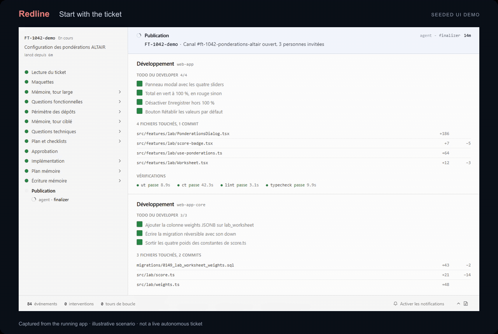
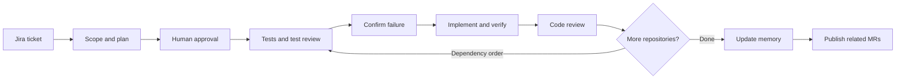

<p align="right"><a href="README.fr.md">Français</a></p>

<p align="center"></p>

[](LICENSE)

<p align="center"><strong>Turn a Jira ticket into coordinated GitLab merge requests.</strong><br>Scope the work. Challenge the tests. Build in dependency order. Keep what you learn.</p>

<p align="center">Claude Code plugin · Adversarial TDD · Versioned memory · <a href="LICENSE">MIT</a></p>

<p align="center"><a href="#start-with-the-code">Quickstart</a> · <a href="#one-ticket-several-repositories">Workflow</a> · <a href="docs/architecture.md">Architecture</a> · <a href="#what-is-verified">Verification</a> · <a href="CONTRIBUTING.md">Contribute</a></p>

**Original repository: [GitLab](https://gitlab.elielaloum.com/elielaloum/redline)** · [Public GitHub mirror](https://github.com/elie-laloum/redline). The GitLab origin is private and requires access. Code changes are integrated in GitLab and synchronized to GitHub.

---

## See it in action

<a href="assets/demo.mp4"></a>

<sub>The running interface, captured with the repository’s seeded scenario. Illustrative data; not an autonomous live-ticket run.</sub>

[Watch the MP4](assets/demo.mp4) · [Reproduce this demo](docs/demo.md)

## One ticket, several repositories

A feature rarely ends at one repository. Redline coordinates the path from a Jira ticket to related GitLab merge requests: clarify requirements, identify affected repositories, approve a plan, implement and challenge each change, then record the knowledge for the next run.

**This is an opinionated working system being opened to other developers.** It currently assumes Claude Code, Jira Cloud, GitLab and Slack. You configure repository paths, commands and dependencies explicitly. The agent prompts are currently in French; this public guide is available in English and French.

Redline is the new public name for **Autopilot**. Existing commands, configuration filenames, plugin identifiers and the state directory retain their `autopilot` names. GitHub hosts the project; the implemented publication integration targets **GitLab merge requests**, not GitHub pull requests.

| What matters | How the project approaches it |
|---|---|
| Changes spanning repositories | Declared dependency levels determine processing order. |
| Tests that mean something | A separate adversary challenges tests; a red check precedes implementation. |
| Focused responsibilities | Test writing, implementation, review and memory updates have separate roles and tool sets. These are not an OS sandbox. |
| Recoverable work | Ticket state records the phase, step and current repository for resumption. |
| Useful memory | Knowledge is versioned, and agents can explicitly report contradictions with the code. |
| Visible progress | An optional live view reads local state and events, with a channel for human questions. |

## The workflow



**The approval has consequences.** The intended workflow has one plan-approval gate. After approval, it can publish branches, tags and merge requests, post to Slack and Jira, and transition the ticket without another routine approval. Escalations can still interrupt it. Upstream publication may happen while processing repository dependencies, before the final publication step.

The final output is a set of merge requests for review. It is not a promise that the changes have been merged or deployed.

## Start with the code

Use **Ubuntu/WSL or another suitable Unix environment**, Git, **Node 22.18+** and pnpm. The existing implementation includes Unix-oriented process handling; native Windows support is not established.

From the repository root:

```bash
pnpm install --frozen-lockfile
pnpm test
pnpm test:workflow
```

The workflow test harness creates temporary Git repositories and local substitutes for Jira, GitLab and Slack. These scripted scenarios exercise the tooling and workflow contracts; they are **not live agent evaluations**.

To run a real ticket, follow the [setup guide](docs/setup.md): declare your repositories, configure credentials and your writing voice, validate configuration, and load the plugin into Claude Code.

The skill entry point defined by the project is:

```text
/autopilot-start <jira-url-or-key> [--notes "…"] [--figma <url>…] [--live]
```

An existing ticket state is resumed. Use Claude Code's skill discovery to check the invocation exposed by your installed version. The public rename does not introduce a new `/redline` command.

## Watch the work

The optional live shell exposes the scope, plan, repository progress, questions and events of a run. It is a view onto the workflow; ticket state remains on disk. See its [product notes](tools/live-shell/PRODUCT.md) and [design notes](tools/live-shell/DESIGN.md).

The animation above captures this interface using the [seeded scenario](tools/live-shell/demo). See [how it was recorded](docs/demo.md).

## What is verified

| Command | Purpose |
|---|---|
| `pnpm test` | Unit tests for deterministic behavior. |
| `pnpm test:workflow` | Scripted workflows using real Git repositories and substitute services. |
| `pnpm typecheck` | Root and live-shell TypeScript checks; install both dependency sets first. |
| `pnpm eval` | Agent evaluation suites; requires Claude Code and a separately reviewed environment. |

There are **15 agent definitions**, with evaluation material for each. Test counts and evaluation scores are deliberately not advertised here: use the output of your own run. The current evaluation script allows real servers and records mocks; it is not an offline smoke test. Read the [evaluation notes](plugins/autopilot/evals/README.md) before running it.

## Current boundaries

- Configuration is explicit. There is no automatic discovery of your stack or test commands.
- Agent instructions and operational messages are still primarily French.
- Automated follow-up on MR feedback, Slack replies and CI after publication is not implemented.
- Memory retrieval uses structured metadata and text search, not a semantic index.
- No end-to-end workflow dry run is provided. The cleanup utility has its own distinct preview option.
- This presentation update does not establish production readiness or validate a live ticket run.

## Build with us

Start with [CONTRIBUTING.md](CONTRIBUTING.md). Useful contributions include reproducible workflow fixtures, clearer setup instructions, agent evaluations and an English prompt edition with regression evaluation.

Created by **Elie Laloum**. Released under the [MIT license](LICENSE).
